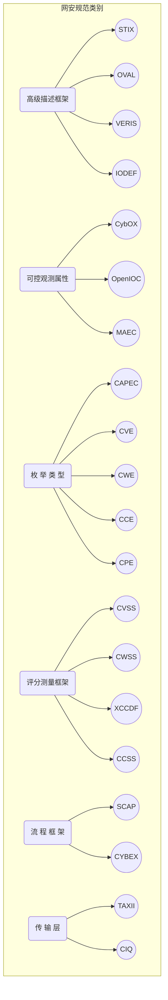
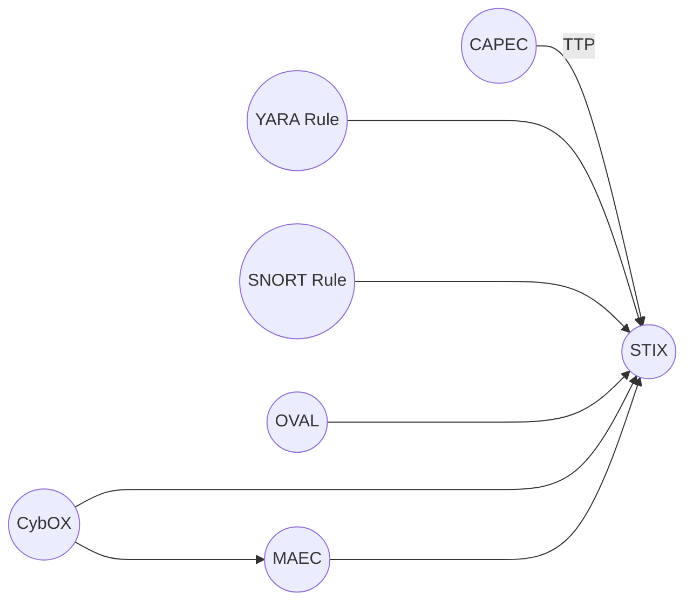

> 网络安全本体UCO学习，TODO。


# UCO

```json
{
    "website": "https://unifiedcyberontology.org/index.html",
    "paper_pdf": "https://ebiquity.umbc.edu/_file_directory_/papers/781.pdf",
    "github_repo": "https://github.com/ucoProject/UCO",
    
}
```


## 论文简介

> **摘要**：在本文中，我们描述了统一网络安全本体UCO，旨在支持网络安全系统中的信息集成和网络态势感知。**UCO整合了不同网络安全系统的异构数据和知识模式，可用作信息共享和交换的网络安全标准。**同时，**UCO本体还与现有的众多网络安全本体及LOD概念建立映射连接。**与LOD中的知识核心DBpedia类似，我们计划将UCO作为网络安全领域的核心，并持久不断的扩充更新数据来健全并发展这一领域。此外，**论文对UCO本体支持的原型系统和具体用例进行介绍**。就我们所知，本文首次将网络安全本体映射到通用世界本体以支持更广泛和多样化的安全应用。我们将UCO本体与之前工作做了比较，讨论其优势和局限性，并对进一步的研究进行思考。

1. 论文试图解决什么问题？

   构建一个尽可能完备的网安领域标准本体库，完备性包含两个方面：一是整合规范现有的多种本体；二是在领域数据与通用领域知识（如LOD）间建立映射。

2. 论文中提到的解决方案之关键是什么？

   - UCO本体构建：（方法）对现有的网络安全标准和本体进行了调查、整编，并选择最常用和最广泛的标准来纳入UCO本体；（功能）UCO要能对不同源的信息进行统一，能支持推理和规则编写；（表示方式）使用了OWL DL[^1]语义描述语言；

   - UCO的权威/完备：领域内对齐网安本体STIX/CVE[^2]/CCE[^3]/CVSS[^4]/CAPEC[^5]/CYBOX[^6]/KillChain[^7]/STUCOO[^8]等，通用领域映射链接LOD，包括DBpedia/Yago等，见下图；

     

   - 基于UCO的原型系统：该系统使用STUCCO抽取器[^9]从NVD的XML文件提取实体，直接从XML文件生成<S，P，O>三元组；同时，定义了从NVD获得的实体到DBpedia相应实体间的映射；最后，三元组和映射被加载到支持查询和推理的Fuseki[^10]服务。


### 扩展

**网络安全标准汇总**（[由论文提供](http://tinyurl.com/ptqkzpq)）




- 高级描述框架：多类信息的整合
  - STIX  - Structured Threat Information eXpression
    - 全称：结构化威胁信息表示
    - 简介：STIX™ 旨在定义和开发一种标准化的语言来表示结构化的网络威胁信息。通过提供一个统一的架构，将各种网络威胁信息联系在一起，包括网络观测值、指标、事件、TTP（包括攻击模式、恶意软件、漏洞利用、杀伤链、实用工具、基础设施、受害者定位等）、利用目标（如漏洞、弱点或配置）、行动方案（如事件相应、漏洞补救与缓解）、网络攻击活动、网络威胁参与者
    - 组织：MITRE/DHS --> OASIS
  - OVAL - Open Vulnerability and Assessment Language
    - 全称：开放漏洞评估语言
    - 简介：OVAL 是对用于评估和报告计算机系统机器状态的标准化。OVAL 包括一种用于对系统细节进行编码的语言，以及遍布整个社区的各种内容存储库。使用 OVAL 进行系统评估的三个步骤：表示系统信息、表示特定机器状态和报告评估结果
    - 组织：MITRE --> CIS
  - VERIS - The Vocabulary for Event Recording and Incident Sharing
    - 全称：事件记录与共享词汇表
    - 简介：VERIS 旨在为以结构化方式描述安全事件及其影响提供一种通用语言。与 STIX 事件相比， VERIS 是用于事件发生后战略趋势分析和风险管理的事后表征，而 STIX 是在更广泛的威胁情报框架下捕获相关安全事件及其影响的信息
    - 组织：Verizon
  - IODEF - The Incident Object Description Format (IODEF)
    - 全称：事件描述格式
    - 简介：IODEF 是为交换事件信息而开发的 Internet 工程任务组 (IETF) 标准。STIX 和 IODEF 之间没有正式关系，尽管可以在 STIX 中利用 IODEF 来表示事件信息，然而，这样做会失去 STIX Incident 结构提供的丰富性和架构一致性
    - 组织：IETF/MILE
- 可控观测属性：网络观测信息表示可用于检测攻击或恶意活动的信息（例如恶意软件使用的系统库），是网络环境中的可测量事件或状态属性。可测量事件包括注册表创建、文件删除和发送 HTTP GET 请求；状态属性包括文件的 MD5 哈希、注册表值和进程名称

  - CybOX - Cyber Observables eXpression

    - 全称：网络可观测数据表示
    - 简介：CybOX 是用于规范/捕获/表征/共享在操作域中可观察的事件或状态属性的标准化模式，提供了一种通用机制（结构和内容）规范所有网络安全用例中的网络可观测数据。各种高级网络安全用例都依赖于此类信息，包括：事件管理/日志记录、恶意软件表征、入侵检测、事件响应/管理、攻击模式表征等。STIX 和MAEC 都有使用 CybOX
    - 组织：MITRE --> OASIS

  - OpenIOC - Mandiant’s Open Indicators of Compromise

    - 全称：Mandiant开放IoC
    - 简介：STIX Indicator's test mechanism field  对 CybOX 未包含的其他指标签名提供扩展方案，其中就包括Mandiant 的开放式妥协指标，此外还有OVAL、SNORT 规则和 YARA 规则
    - 组织：MANDIANT

  - MAEC - Malware Attribute Enumeration and Characterization

    - 全称：恶意软件属性枚举与表征
    - 简介：MAEC 是一种标准化语言，用于根据行为、工件和攻击模式等属性对恶意软件信息进行编码和通信。MAEC 可以消除恶意软件描述中的模糊性和不准确性，并减少对签名的依赖。STIX 通过 TTP 结构结合 MAEC
    - 组织：MITRE/DHS

- 枚举类型：通过定义全局标识符共享数据

  - CAPEC - Common Attack Pattern Enumeration and Classification

    - 全称：常见攻击模式枚举与分类
    - 简介：CAPEC 是一个常见攻击模式列表，对攻击模式详情和类别进行描述。STIX 使用 CAPEC 模式扩展来结构化表征战术、技术和程序 (TTP) 攻击模式
    - 组织：MITRE/DHS

  - CVE - Common Vulnerabilities and Exposures

    - 全称：通用漏洞与风险
    - 简介：CVE 是对已知漏洞和安全缺陷的标准化名称的列表。CVE 只包含带有状态指示器的标准标识符号、简短描述和对相关漏洞报告和警告的引用，不包括风险、影响、修复或详细的技术信息。CVE 的通用标识符使得安全产品之间的数据可进行交换，并为评估工具和服务提供基准索引点
    - 组织：MITRE/DHS

  - CWE - Common Weakness Enumeration 

    - 全称：通用弱点/缺陷枚举
    - 简介：CWE 是一个通用的在线计算机软件缺陷字典，使用一种通用的语言用来描述软件在架构、设计以及编码等环节存在的安全弱点。可以帮助人们更好地理解软件的缺陷，并创建能够识别、修复以及阻止此类缺陷的自动化工具
    - 组织：MITRE/DHS

  - CCE -  The Common Configuration Enumeration

    - 全称：通用配置枚举
    - 简介：CCE 为系统配置问题提供唯一标识符，将唯一标识分配给配置指导语句和配置控制，以促进跨多个信息源和工具快速准确地关联配置数据。
    - 组织：MITRE--> NIST

  - CRE - Common Platform Enumeration

    - 全称：通用平台枚举
    - 简介：CPE 是描述企业计算资产中的应用程序、操作系统和硬件设备类别的标准化方法。CPE 不会识别系统中产品的唯一实例，如XYZ Visualizer Enterprise Suite 4.2.3的安装序列号Q472B987P113，而是标识产品的抽象类，例如 XYZ Visualizer Enterprise Suite 4.2.3、XYZ Visualizer Enterprise Suite（所有版本）或 XYZ Visualizer（所有变体）。
    - 组织：MITRE--> NIST

- 评分测量框架：对威胁定量描述的定义

  - CVSS - Common Vulnerability Scoring System

    - 全称：通用漏洞评分系统
    - 简介：CVSS 用于评估计算机系统安全漏洞的严重性，评分可以衡量漏洞值得关注的程度。CVSS 由三个度量组组成：Base、Temporal 和Environment。 Base 类表示漏洞的本身特性，Temporal 类反映漏洞随时间变化的特征，Environment 类表示用户环境特有的漏洞特征。基本指标生 0 到 10 之间的分数，然后使用时间和环境指标修正分数。
    - 组织：FIRST

  - CWSS -  Common Weakness Scoring System

    - 全称：通用弱点评分系统
    - 简介：CWSS 标准化了描述弱点的方法，并对软件弱点进行优先排序。使用 CWSS，用户可以通过攻击面和环境指标充分利用上下文信息，更准确地反映软件风险。CWSS 可以CVSS一起使用
    - 组织：MITRE/DHS

  - XCCDF - The Extensible Configuration Checklist Description Format

    - 全称：可扩展配置清单描述格式
    - 简介：XCCDF 是一种用于编写安全检查表、基准和相关类型文档的规范语言。 XCCDF 文档代表一组目标系统的安全配置规则的结构化集合。该规范旨在支持信息交换、文档生成、组织和情境定制、自动化合规性测试和合规/compliance评分，该规范还定义了用于存储基准合规性测试结果的数据模型和格式
    - 组织：NIST

  - CCSS - Common Configuration Scoring Scheme

    - 全称：通用配置评分方案
    - 简介：CCSS 是一组衡量软件安全配置问题严重性的指标，旨在解决软件安全配置漏洞，是对 CVSS 和 CMSS 的补充
    - 组织：NIST

- 流程框架：利用其他标准格式和协议交换安全相关信息的框架

  - SCAP - The Security Content Automation Protocol

    - 全称：安全内容自动化协议
    - 简介：SCAP 是一种使用确定标准（其他开放标准，称SCAP“组件”）来实现自动化漏洞管理、测量和策略合规性评估（如 FISMA 合规性）的方法。SCAP 可结合其他软件缺陷、配置枚举的开放标准，测量系统以发现漏洞并进行评分，以评估可能的影响。SCAP“组件”包括有CVE、CCE、CPE、CWE、CVSS、XCCDF、OVAL
    - 组织：NIST

  - CYBEX - Cybersecurity Information Exchange, Recommendation ITU-T X.1500

    - 全称：网络安全信息交换
    - 简介：ITU-T X.1500 建议书描述了安全信息交换技术。其中，与信息交换相关的主要功能有构建安全信息、识别安全信息和实体；在实体之间建立信任；请求和响应安全信息；确保安全信息交换的完整性。
    - 组织：ITU-T

- 传输层

  - TAXII - Trusted Automated eXchange of Indicator Information

    - 全称：指标信息的可信自动交换
    - 简介：TAXII 是 STIX 中网络威胁信息的主要传输机制。使用 TAXII 服务，组织之间能以安全和自动化的方式共享网络威胁信息
    - 组织：OASIS

  - CIQ - The OASIS Customer Information Quality 

    - 全称：OASIS 客户质量信息
    - 简介：CIQ 是一种表示个人和组织信息的语言。CIQ Specifications 使不同组织能够对当事人信息/数据进行唯一标识、集成、标准化、匹配、同步和管理，并用来支持各种应用需求。STIX Identity 结构使用了 CIQ 来表示用于表征攻击者、受害者和情报来源的识别信息
    - 组织：OASIS




## UCO详解


### .ttl .owl


[^1]: http://www.w3.org/TR/owl-guide/

[^2]: https://cve.mitre.org/
[^3]: https://cce.mitre.org/
[^4]: https://www.first.org/cvss
[^5]: https://capec.mitre.org/
[^6]: https://cyboxproject.github.io/
[^7]: http://vistology.com/ont/STIX/killchain.owl
[^8]: https://github.com/stucco/ontology/blob/master/stucco_schema.json
[^9]: https://github.com/stucco/extractors
[^10]: https://jena.apache.org/documentation/fuseki2/


